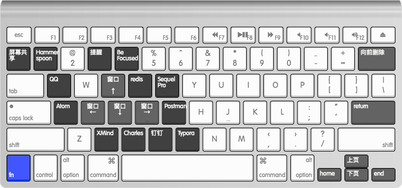

## 脚本整理融合

感谢 [jasonrudolph](https://github.com/jasonrudolph/keyboard) 分享出来的hammperspoon脚本. 其实hammerspoon很好玩相关功能 和 一些大牛的深度玩法。
代码在[github](https://github.com/xujiazhe/keyboard/tree/xujiazhe)上
mac的应用窗口和应用切换功能太弱.
	在win下有
		win+数. 切换任务栏上的窗口 !
		win+方向键调整当前窗口 !

​	linux下有i3wm

## 功能列表

- [切换应用](#切换应用)   Fn/opt + 数字/字母 -> 切换/启动 应用
- [窗口调整](#窗口调整)   Fn + sdfe 调整
- [karabiner配置](#karabiner配置)  键位映射和space模式
- [一些APP下的功能](#一些APP下的功能) 在一些app下的特别功能


### 切换应用

Fn/Alt  +  数字/符号/大小写字母 切换应用

在 hammerspoon/app_launch_key.lua 文件中, 这两个配置表, 是 键<-->应用 关联表

<u>摁住opt, 敲下2后, 就是idea, 在敲下2, 如果idea的窗口有多个, 就切换idea的窗口, 这个功能需要HyperSwitch配合, 设置alt+`是应用窗口切换</u>

*hammerspoon/app_name.lua 应用的  名字  和 文件名切换*

```lua
local fn_app_key = {
    a = "Sublime Text",
    b = "Typora",
    B = "GitBook Editor",
    v = "钉钉",
    q = "QQ",
    g = "Postman",
    ['1'] = "Be Focused",
    ['2'] = "Reminders",
    ['3'] = "日历",
    ['4'] = "Hammerspoon",
    ['`'] = "屏幕共享",
    ['t'] = "Sequel Pro"
}

local alt_app_key = {
    ['1'] = 'iTerm',
    ['!'] = "Terminal",
    ['2'] = 'IntelliJ IDEA',
    ['@'] = "Atom",
    ['3'] = 'Safari',
    ['#'] = 'Google Chrome',
    ['4'] = 'PyCharm',
    ['5'] = 'DataGrip',

    f = 'Notes',
    e = 'Finder',
    E = 'Microsoft Excel',
    v = '微信',

    [';'] = 'Photos',
    ['\''] = 'MPlayerX',
    [','] = '系统偏好设置'
}
```
Fn键功能图

Alt键功能图


### 窗口调整

1. Fn + sdfe 灵活调整窗口 类似 win + 方向键
  - sdfe 就当方向键, 摁e, 窗口就往上走, 恩 是走到上面去 !


### karabiner配置

*针对不同的键盘设备可有不同的配置.*

- caps_lock     ->   right_control
- left_control   ->    删除 / Fn


1. 按住space, 进入spacebar模式, 该模式下的  键位映射有

  - <kbd>esdf</kbd> ->方向键
  - <kbd>wrxv</kbd> -> home, end, pageup, pagedown
  - <kbd>\`</kbd>, <kbd>1-9,0,-,=</kbd>-> ESC,   F1 ~ F12
  - <kbd>b</kbd> -> 空格,   <kbd>z</kbd> -> ESC

2. 快键 就是单独短时按下

  - left_cmd   ->    方向键下
  - left_opt     ->    方向键上
  - left_ctrl     ->    enter
  - 双shift       ->    caps_lock

#### 图示
初始布局

按住spacebar进入spacebar模式

按一下w切换到鼠标模式

按住a进入滚轮模式

spacebar模式和fn结合的功能图

spacebar模式和alt结合的功能图

系统中的键设置

spacebar模式和ctrl结合的功能图


###### TODO 一般键盘有按键冲突 比如  Spacebar+Fn+ -号 不能减小声音

### 一些APP下的功能


1. 我用台式机工作, 笔记本开会, 两台机器之间有时候远程桌面操作,  微信/钉钉 在笔记本上常开.
   在台式机上摁下  Fn/opt + v的时候, 是打开 远程窗口(台式机) 上的 微信/钉钉

2. 在Finder, Reminder, 备忘录中 cmd + 1 是toggle边栏.
3. 在终端 alt + h/l 前/后删词, iterm2


📣 Shout-out to [Karabiner's Simultaneous vi Mode](https://github.com/tekezo/Karabiner/blob/05ca98733f3e3501e0679814c3795d1cb57e177f/src/core/server/Resources/include/checkbox/simultaneouskeypresses_vi_mode.xml#L4-L10) for providing the inspiration for (S)uper (D)uper Mode. ⌨:neckbeard:✨


## 依赖环境

- macOS Sierra, 10.12
- [Karabiner-Elements 0.91.7][karabiner]
- [Hammerspoon 0.9.52][hammerspoon]
- [HyperSwitch][hyperswitch]


## 安装使用

1. 下载代码

   ```sh
   git clone https://github.com/jasonrudolph/keyboard.git ~/.keyboard

   cd ~/.keyboard

   script/setup
   ```

2. 如果有自己hammerspoon脚本 或 karabiner.json, 自己做好整合哈. 使用后果自负.

3. Enable accessibility to allow Hammerspoon to do its thing [[screenshot]](screenshots/accessibility-permissions-for-hammerspoon.png)

4. 这个脚本有点bug, 能撑一个小时, 失灵了就 Fn/opt + shift + r, 重载一下 ^^.

## 开发

hammerspoon是什么?

    系统的api 和 动态库
    lua壳和lua扩展, lua程序配置
    程序界面和外壳

hammerpoon的发展和结构

    自带lua解释器
    其path路径 和 运行路径

调试开发

    包路径
        原来自带的路径
        luarocks  库包
    添加路径
          local yourPath = '你自己的lua包路径'
            package.path = yourPath .. '?.lua;' .. package.path;
            require('init')  #加载入口脚本
    装载
        装载代码
        /usr/local/bin/hs  执行注入
    debug方法  自带的方法?
    简写 hsa'Chrome'
    动态注入
        spoon.


## TODO
##### TODO 菜单键(激活菜单后, 1234分别对应第几个选项)
- Add [#13](https://github.com/jasonrudolph/keyboard/pull/13) to [features](#features):
    - Hold option for push-to-talk/push-to-mute
    - Double-tap option to mute/unmute microphone

[customize]: http://dictionary.reference.com/browse/customize
[don't-make-me-think]: http://en.wikipedia.org/wiki/Don&amp;amp;amp;amp;amp;amp;amp;amp;amp;amp;amp;amp;amp;amp;amp;amp;amp;#39;t_Make_Me_Think
[karabiner]: https://github.com/tekezo/Karabiner-Elements
[hammerspoon]: http://www.hammerspoon.org
[hammerspoon-releases]: https://github.com/Hammerspoon/hammerspoon/releases
[hyperswitch]: https://bahoom.com/hyperswitch
[modern-space-cadet]: http://stevelosh.com/blog/2012/10/a-modern-space-cadet
[modern-space-cadet-key-repeat]: http://stevelosh.com/blog/2012/10/a-modern-space-cadet/#controlescape


* My Hammerspoon configuration
  :PROPERTIES:
  :CUSTOM_ID: my-hammerspoon-configuration
  :END:

[[http://www.hammerspoon.org/][Hammerspoon]] is one of the most-used utilities on my Mac. This repository contains my personal configuration, which you can use as a starting point and modify to suit your needs and preferences.

** What happened to Oh-My-Hammerspoon?
   :PROPERTIES:
   :CUSTOM_ID: what-happened-to-oh-my-hammerspoon
   :END:

With the arrival of [[https://github.com/Hammerspoon/hammerspoon/blob/master/SPOONS.md][Spoons]] in [[http://www.hammerspoon.org/releasenotes/0.9.53.html][Hammerspoon 0.9.53]], the oh-my-hammerspoon plugin mechanism became obsolete. I have converted all the old plugins into Spoons, so this repository offers the same (and some new) functionality, but much easier to understand and configure. Some of them have been merged already in the [[http://www.hammerspoon.org/Spoons/][official Spoons repository]], and others are available in [[https://zzamboni.github.io/zzSpoons/][my personal zzSpoons repository]].

If you still want it, the old oh-my-hammerspoon code has been archived in the [[https://github.com/zzamboni/oh-my-hammerspoon/tree/old-oh-my-hammerspoon][old-oh-my-hammerspoon branch]].

** How to use it
   :PROPERTIES:
   :CUSTOM_ID: how-to-use-it
   :END:

1. Install [[http://www.hammerspoon.org/][Hammerspoon]] (minimum version required: 0.9.55, which introduced the =hs.spoons= module)

2. Clone this repository into your =~/.hammerspoon= directory:
   #+BEGIN_EXAMPLE
       git clone https://github.com/zzamboni/oh-my-hammerspoon.git ~/.hammerspoon
   
#+END_EXAMPLE
   
3. Review [[file:init.lua][init.lua]] and change or disable any Spoons as needed. Note that this file is generated from [[file:init.org][init.org]], where you can read also a full description of the code.

4. Run Hammerspoon.

5. All the necessary Spoons will be downloaded, installed and configured.

6. Have fun!


npm install  @vitalets/google-translate-api

ln -sfn /opt/keyboard/karabiner $PWD/
ln -sfn ~/.inputrc $PWD/
ln -sfn ~/.inputrc $PWD/
ln -sfn ~/.zshrc $PWD/


